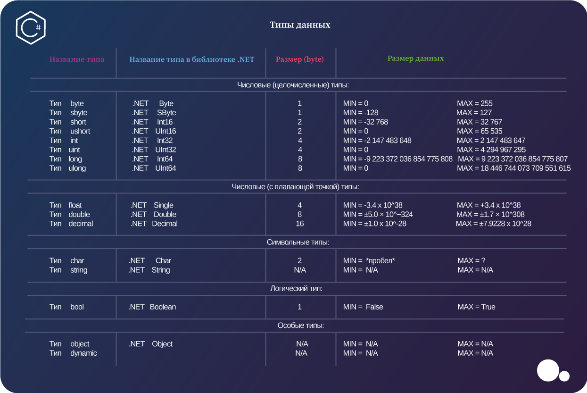

# Конспект
## Консольные команды
- Создать новый проект: dotnet new console
- Запустить проект: dotnet run
- Создать gitignore файл: dotnet new gitignore

## С#
### Перед командой необходимо добавить Console.
### Закончить строку необходимо ;
- Вывод в одну строку: Write()
- Вывод с переносом строки: WriteLine()
- Считать строку: ReadLine()

### Другие команды
- Условия if else:  
```csharp
if (условие)
{
    блок кода
}
else
{
    блок кода
}
```
- Цикл while:
```csharp
while (условие)
{
    блок кода
}
```
- Цикл for 'for (int <перменная счётчика>; <условие со счётчиком>; <увеличение счётчика>)':
```csharp
for (int i; i < 0; i++)
{
    блок кода
}
```
- Случайное числа от min до max - 1: new Random().Next(min, max)
- Преобразовать в нижний регистр: .toLower()
- Преобразовать входные данные из строки в другой тип: <тип>.Parse(<строка>)
- Конвертировать из одного типа в другой: Convert.To<тип>(<что конвертировать>)


### Шпаргалка по типам данных в CSharp
